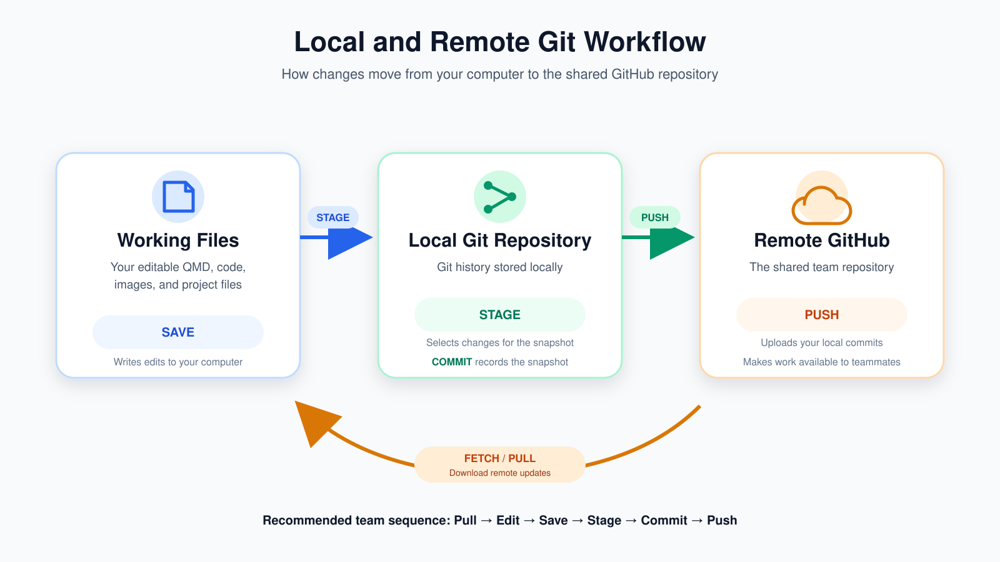
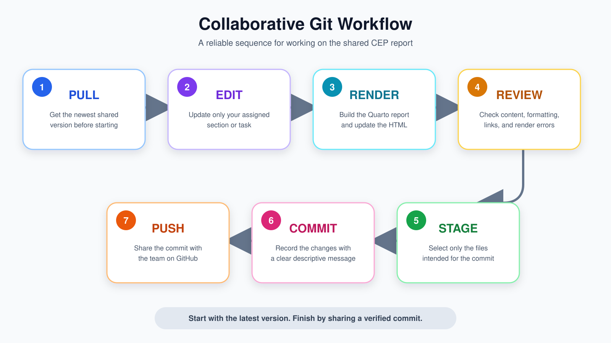

# Prompt 1: Repository Setup and Shared Ownership

**Principal Author:** Yushan Huang

Our group created one shared CEP repository from the MSDM CEP template and uses that repository as the single source of truth for the project. Using a template means starting from the instructor-provided repository structure and files, while creating a repository means generating a new GitHub repository owned by our group. Cloning is different from both of these actions: cloning creates a local copy of the existing shared repository on a group member's computer and preserves its Git connection to the remote repository on GitHub. After the group repository was created, the appropriate visibility setting was selected, all group members were invited as collaborators, and each member was expected to clone the same repository rather than create a separate copy of the original template.

This shared setup is important because Git collaboration depends on everyone working from the same repository history. If each person independently created a new repository from the template, or simply copied the template files into unrelated folders, the group would end up with separate Git histories and separate remote repositories. In that situation, members could not reliably pull one another's changes, the commit history would not provide a complete record of the group's work, and combining everyone's files later could create duplication or version conflicts. For this practice assignment, our group therefore treats the shared repository as the authoritative project location and each member's clone as a local working copy of that same project.

> A useful way to remember the difference is: **template = starting structure, repository = shared project, clone = local connected copy.**

::: callout-note
## Group 8 setup rule

Every member should confirm that they are working from the same shared Group 8 CEP repository before editing the collaboration-practice report.
:::

# Prompt 2: Local, Remote, and Working Files

**Principal Author:** Yushan Huang

The files we edit on our own computers are our **working files**, and they are located inside a **local Git repository**. The local repository contains both the current project files and Git's record of committed changes. The **remote repository** is the shared version stored on GitHub. These three layers are related, but an action in one layer does not automatically update the others. For example, saving a QMD file only writes the latest edits to the file on the local computer. It does not stage, commit, or upload those edits to GitHub.

The main Git actions represent different stages of the workflow. **Saving** writes changes to the working file. **Staging** selects specific changed files or changes to include in the next commit. **Committing** records the staged changes as a named snapshot in the local Git history. **Pushing** sends local commits to the remote GitHub repository. **Fetching** checks the remote repository for new commits and downloads information about them without automatically integrating them into the current working branch. **Pulling** retrieves remote changes and integrates them into the local branch. This is why saving a QMD file does not make the change visible to teammates: the change remains only on the local computer until it has been staged, committed, and pushed to the shared remote repository.

Table @tbl-workflow summarizes the difference among these actions.

| Action | Where it acts | Main purpose | Visible to teammates immediately? |
|------------------|------------------|------------------|------------------|
| Save | Working file | Write edits to the local file | No |
| Stage | Local Git repository | Select changes for the next commit | No |
| Commit | Local Git repository | Record a snapshot in Git history | No |
| Push | Remote GitHub repository | Upload local commits | Yes, after the push succeeds |
| Fetch | Local Git repository | Download information about remote changes | No automatic merge |
| Pull | Local Git repository and working files | Retrieve and integrate remote changes | Updates the local copy |

: Git and file workflow actions

Because multiple people are contributing to one report, our normal working sequence should be **Pull → Edit → Render → Review → Stage → Commit → Push**. Pulling before editing reduces the risk of starting from an outdated version, while descriptive commits make it easier to understand the purpose and authorship of each change later.[^1]

[^1]: A clear commit history also provides evidence that each group member worked through Git and GitHub rather than exchanging separate files.

# Prompt 3: Document Your Group's Round 1 Workflow

Principal Author: **Simran Kaur**

| Member | Section or content added | Pulled before editing? | Commit message | How push was verified |
|---------------|---------------|---------------|---------------|---------------|
| Yushan Huang | Prompts 1 and 2; initial report structure | N/A - first editor | Create collaboration practice report and add Yushan's responses to Prompts 1 and 2 | *Commit appeared in the GitHub repository history* |
| Simran Kaur | Prompts 3 and 4 | Yes, confirmed with the group | Add Simran's responses for Prompts 3 and 4 | *Commit appeared in the GitHub repository history* |
| Gabriela | Prompts 5 and 6 | Yes, confirmed with the group | *Update Group 8 week 3 collaborative practice* | *Commit appeared in the GitHub repository history* |
| Veronica Vega | Prompts 7 and 8 | Yes, confirmed with the group | Add Veronica's responses for Prompts 7 and 8. | *Commit appeared in the GitHub repository history* |
| Alondra Rodriguez | Prompts 9 and 10 | Yes, confirmed with the group | Add Alondra's responses to prompts 9 and 10 | *Commit appeared in the GitHub repository history* |

For Round 1, our group used a coordinated sequential workflow so that each member began from the most recent version of the shared report. Yushan first created the report structure and completed Prompts 1 and 2. The remaining members then contributed their assigned sections—Simran completed Prompts 3 and 4, Gabriela completed Prompts 5 and 6, Veronica completed Prompts 7 and 8, and Alondra completed Prompts 9 and 10. Before editing, each member confirmed that the previous contribution had been pushed to GitHub and pulled the newest version of the repository. After completing an assigned section, the member rendered the report, reviewed the output, committed the changes with an identifiable message, pushed the commit, and confirmed that it appeared in the GitHub repository history before the next member continued.

This sequential workflow gave the group a clear handoff process and reduced the risk of working from outdated copies of the QMD file. It also minimized the chance that two members would change the same lines at the same time, which could create a merge conflict. Just as importantly, the workflow created a traceable Git history showing the sequence, purpose, and authorship of each Round 1 contribution. This made the shared repository the single source of truth rather than requiring the group to exchange separate versions of the report.

# Prompt 4: A Reliable Everyday CEP Workflow

**Principal Author:** Simran Kaur

1.  Confirm my assigned section and make sure no teammate is editing the same section.

2.  Open the shared CEP repository in Positron.

3.  Pull the newest version from GitHub before editing.

4.  Edit only my assigned section and save the QMD file.

5.  Render the report and check the content, formatting, and links.

6.  Review my changes and stage only the appropriate files.

7.  Commit the changes using a clear message that describes my contribution.

8.  Pull again to check for new updates, resolve any conflicts if necessary, and push my commit to GitHub.

9.  Check the repository history to confirm that the push succeeded.

10. Notify the group that my contribution is complete.

Pulling before editing ensures that a group member starts with the latest version of the shared report. This lowers the risk of working from an outdated file, overwriting a teammate’s contribution, or creating a merge conflict. Pulling again before pushing also helps identify any changes made while the member was working.

Focused and descriptive commit messages make the repository history easier to understand. For example, “Add Simran’s responses for Prompts 3 and 4” clearly identifies the author and purpose of the contribution, while a vague message such as “update” does not. Clear commit messages help the group and instructor track each person’s work, locate changes, and understand how the report developed over time.

# Prompt 5: Coordinating Work and Preventing Merge Conflicts

**Principal Author:** *Gabriela Raygoza Quintero*

> When two teammates are editing the same lines of the same QMD file and trying to push the changes they made, GitHub may detect that the changes being made are conflicting with one another. If one person’s updates are pushed first, then the second person who is pushing their changes may be rejected because they no longer have a version that is up to date or current. A ***merge conflict*** can occur in this case because GitHub can not automatically detect which changes should be kept.
>
> #### *To reduce merge conflicts:*
>
> As a team, we will ***divide*** the prompts into sections that every team member can work on, this way they are aware and responsible for their assigned section/prompt. Doing so will avoid editing another team member's section at the same time. We will ***communicate*** with the group ***via group chat*** when we are actively editing and working on the QMD file, like letting the team know when you are working on a certain section. Before working on the assigned section, the team member will ***PULL*** the ***most recent version*** of the QMD file from GitHub ***before*** beginning any work so that they are working on the ***latest*** version of the file. When a team member is ***finished***, they will communicate with the group that their section is ready. The member will ***render*** AND ***inspect*** that everything looks accurate, and then ***commit*** AND ***push*** the changes made so that the next member may pull the updated version before moving forward with their section.

# Prompt 6: Responding to a Push Rejection or Merge Conflict

**Principal Author:** *Gabriela Raygoza Quintero*

::: callout-important
**If the push is rejected:**

The first member should **NOT** force the push if another group member has already pushed the changes to the same section.
:::

> The member should first pull the most current changes from the repository. The team member should use Positron's merge editor or should use the conflict markers in the QMD file in order to compare the current local changes with the changes made from the repository.

::: callout-note
**After reviewing both versions:**

The team member will review both versions and determine which content to keep or combine based on the work that was meant to be included in the report.
:::

> They should ensure that the final version has the correct information provided by both members that worked on the section. Once a decision has been made, the member should remove any conflict markers from the QMD file and ensure the section has the appropriate formatting.
>
> The team member will then render the QMD file and inspect the report to ensure the conflict has been resolved and that the report displays correctly. Once confirming that the report is correct, they will commit the conflict resolution with a commit message and then push the updated or resolved changes to GitHub.

::: callout-caution
**Inappropriate behavior:**

Force-pushing would not be appropriate because it can overwrite any changes that another team member has already pushed. Deleting another members work would just remove any contributions provided instead of resolving the conflict, therefore creating more work for the group. Replacing the repository with an older local copy can overwrite any new progress done leading to any changes from other members to be lost. The overall goal of resolving a conflict is to combine or retain the adequate changes while preserving the contributions made by everyone in the team.
:::

# Prompt 7: Branches, Issues, and Pull Requests

**Principal Author:** *Veronica Vega*

GitHub Issues are used to follow tasks, questions and all kinds of discussions related to a project on GitHub. These Issues enable developers to organize their work and solve problems together. In GitHub every repository has not just a main branch but can also have other so-called branches to work on a new feature or bug fix for example. When a branch is ready for use in the main branch a so-called pull request is created to allow other team members to review the changes before they are merged into the main branch.

The listed tools will aid collaboration throughout the CEP project. Issues will be used to assign tasks and keep track of progress throughout the project. Branches can be used by members to work on large changes individually. The pull request then offers the chance for review and feedback before the work is merged into the report. For minor updates that are well-coordinated, it is acceptable to edit the main branch directly. However, for larger changes such as data analysis updates or major updates to content, it is recommended to work in a branch and then use a pull request to ensure error-free and high quality updates.

# Prompt 8: Review the Repository History

**Principal Author:** Veronica Vega

The repository history for our group project provides clear evidence of participation by all team members to contributions made via Git and GitHub as opposed to simply passing files around via email. Every commit consists of the identity of the person who made the change, the time it happened and a description of changes made.

When you look at the commit history for the repository for a report done by a group, you can see the order in which things were changed by the group and why they were changed. Therefore, if someone wrote an effective commit message for the addition of a section, for example, that section can be located easily by searching for that commit message. For example, the commit message “Add Veronica's responses for Prompt 7 and Prompt 8” clearly indicates that that was the work of Veronica for those two prompts.

# Prompt 9: Security, Confidentiality, and Repository Hygiene

**Principal Author:** Alondra Rodriguez

Our group must protect confidential information when using the CEP repository, even if the repository is private. We must never push confidential client data, personally identifiable information, passwords, API keys, or access tokens. These materials could expose private information or allow unauthorized access to accounts. Our practice report should use a fictional client name and exclude restricted information. Temporary files, local session files, and unnecessary generated files should also stay out of the repository. However, the final QMD and self-contained HTML files must be included because they are required deliverables for this assignment.

A `.gitignore` file tells Git which untracked files or folders to ignore, helping prevent unnecessary or sensitive local files from being staged accidentally. It does not remove files already tracked by Git or erase information from previous commits, so it cannot replace careful review. Before committing, each member should inspect the staged changes and confirm that every included file is appropriate to share. If a member is uncertain whether information may be uploaded, they should stop and ask the instructor and, when applicable, the authorized client contact before proceeding.

# Prompt 10: Group Collaboration Agreement

**Principal Author:** Alondra Rodriguez

::: callout-important
## Group 8 Git/GitHub Collaboration Agreement

- **Pull and push:** Each member will pull the latest changes before editing and push completed work after rendering, reviewing, and committing it. Members will confirm that their commits appear on GitHub before handing work to the next person.

- **Work assignments:** The group will assign sections by name in a shared task list or GitHub Issue so everyone knows their responsibilities.

- **Editing coordination:** During this practice assignment, members will edit the shared report one at a time. For future work, simultaneous editing will be limited to separate, agreed-upon sections or files.

- **Commit messages:** Members will use focused, descriptive messages that identify the work completed, such as “Add Alondra’s responses to Prompts 9 and 10.”

- **Branches and pull requests:** Major revisions or changes requiring group review will use a branch and pull request. Small, coordinated edits may be committed directly to the main branch.

- **Conflicts and failed pushes:** Members will communicate with the affected teammate, pull the latest changes, and carefully combine the necessary content. They will render and review the resolved report before committing and pushing. Members will not force-push or overwrite a teammate’s work to bypass a conflict.

- **Rendering checks:** Every member will render and inspect the report after their changes. A designated final editor will verify the complete report, links, and required files before submission.

- **Confidentiality:** Members will review staged files, maintain appropriate `.gitignore` rules, and keep confidential data and credentials out of the repository. Uncertain material will be checked with the instructor before sharing.

**Agreement status:** All group members have reviewed this agreement and agree to follow it.
:::

# Appendix: Collaboration Evidence

## Member Contribution Table

| Member | GitHub Username | Round 1 Commit Message | Round 2 Commit Message |
|------------------|------------------|------------------|------------------|
| Yushan Huang | SashaHuang1 | Create collaboration practice report and add Yushan's responses to Prompts 1 and 2 | Improve prompt3 |
| Simran Kaur | *\[Add GitHub username\]* | Add Simran's responses for Prompts 3 and 4 | *\[Add exact Round 2 commit message\]* |
| Gabriela Raygoza Quintero | gabrielarq1 | Update Group 8 week 3 collaborative practice | *\[Add exact Round 2 commit message\]* |
| Veronica Vega | *\[Add GitHub username\]* | Add Veronica's responses for Prompts 7 and 8. | *\[Add exact Round 2 commit message\]* |
| Alondra Rodriguez | arodriguezz240 | Add Alondra's responses to prompts 9 and 10 | *\[Add exact Round 2 commit message\]* |

## Required Links

- **Group GitHub repository:** *\[Insert clickable repository URL\]*
- **Published GitHub Pages report:** *\[Insert clickable GitHub Pages URL\]*
- **Repository commit history:** *\[Insert clickable commit-history URL\]*

## Collaboration Confirmation

All group members used Positron, RStudio, or the IDE Terminal to pull, stage, commit, and push their changes. The QMD and HTML files were not uploaded or edited through the GitHub website as a substitute for the required Git workflow.

**Final editor:** *\[Insert the name of the member who performs the final pull, render, link check, and push.\]*
